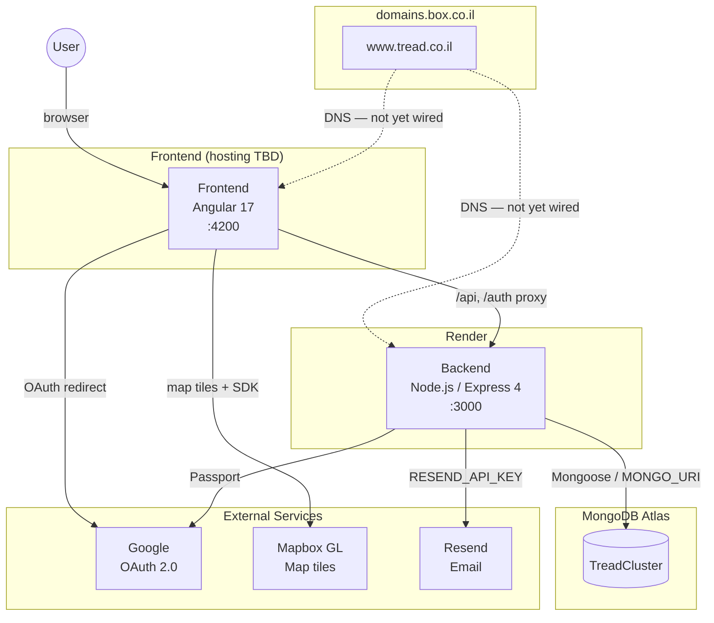

# Tread — Project Reference

תִּדְרֹךְ is an Israel places tracker: an interactive map where users log the locations they've visited across the country.

---

## Architecture

---

## Domain & Hosting

| | |
|---|---|
| **Domain** | `www.tread.co.il` |
| **Registrar** | domains.box.co.il |
| **Deployment** | Render — https://dashboard.render.com/web/srv-d6e349ctgctc73cjl2b0 |
| **Render outbound IPs** | `74.220.48.0/24`, `74.220.56.0/24` (whitelist in MongoDB Atlas → Network Access) |

---

## Tech Stack

### Frontend (`frontend/`)
- **Angular 17** with standalone components and signals
- **Angular Material 17** for UI
- **Mapbox GL v3.4** for the interactive map (see TODOs — candidate for replacement)
- **RxJS**, zone.js
- Dev server: `http://localhost:4200`, proxies `/api` and `/auth` to backend

### Backend (`backend/`)
- **Node.js** + **Express 4**
- **Mongoose 8** → MongoDB
- **Passport** + **passport-google-oauth20** for login
- **jsonwebtoken** — HS256, 30-day expiry
- **Resend** — sends email notifications when a user suggests a place edit or new place
- **helmet**, **cors**

### Database
- **MongoDB** — local dev: `mongodb://localhost:27017/tread`
- Production: MongoDB Atlas (connection string via `MONGO_URI`)
- Collections: `places`, `users`

---

## External Services & Accounts

| Service | Purpose | Where configured |
|---|---|---|
| **Google Cloud Console** | OAuth 2.0 login | `GOOGLE_CLIENT_ID` / `GOOGLE_CLIENT_SECRET` in `backend/.env` |
| **Mapbox** | Interactive map | Token hardcoded in `frontend/src/environments/environment.ts` |
| **Resend** | Email notifications for place suggestions | `RESEND_API_KEY` in `backend/.env` |
| **MongoDB Atlas** | Production database — https://cloud.mongodb.com/v2/699c1a758df98bd8630a50b3#/clusters/detail/TreadCluster | `MONGO_URI` in `backend/.env` |
| **domains.box.co.il** | Domain registrar for tread.co.il | External account |

---

## Environment Variables

All in `backend/.env` (no `.env.example` exists — create one if onboarding others).

| Variable | Description | Dev default |
|---|---|---|
| `PORT` | Backend port | `3000` |
| `MONGO_URI` | MongoDB connection string | `mongodb://localhost:27017/tread` |
| `GOOGLE_CLIENT_ID` | Google OAuth client ID | — |
| `GOOGLE_CLIENT_SECRET` | Google OAuth client secret | — |
| `JWT_SECRET` | Secret for signing JWTs | — |
| `FRONTEND_URL` | Frontend origin (CORS + OAuth redirect) | `http://localhost:4200` |
| `RESEND_API_KEY` | Resend API key for suggestion emails | — |
| `NOTIFY_EMAIL` | Email address that receives suggestions | — |

---

## Key Scripts

Run from the **repo root** unless noted.

| Command | What it does |
|---|---|
| `npm run install:all` | Installs dependencies for root, backend, and frontend |
| `npm start` | Runs backend + frontend concurrently |
| `npm run seed` | Clears and re-seeds the `places` collection (~60+ places) |
| `npm test` | Runs all Jest tests (backend + frontend via monorepo config) |
| `cd backend && npm test` | Backend tests only (Jest + Supertest + mongodb-memory-server) |
| `cd frontend && npm test` | Frontend tests only (Jest + jest-preset-angular) |

---

## API Endpoints

| Method | Path | Auth | Description |
|---|---|---|---|
| GET | `/auth/google` | — | Start Google OAuth flow |
| GET | `/auth/google/callback` | — | OAuth callback → redirects to `/callback?token=...` |
| GET | `/health` | — | Health check |
| GET | `/api/places` | — | All places (optional `?category=` / `?region=`) |
| GET | `/api/places/search?q=` | — | Search by name / alias |
| GET | `/api/places/:id` | — | Single place |
| GET | `/api/users/me` | JWT | Current user profile |
| POST | `/api/users/me/visits` | JWT | Mark place visited `{ placeId }` |
| DELETE | `/api/users/me/visits/:id` | JWT | Unmark visited |
| POST | `/api/suggest-edit` | JWT | Suggest edit `{ before, after }` → email |
| POST | `/api/suggest-new` | JWT | Suggest new place `{ place }` → email |

---

## Data & Seed

- ~60+ Israeli places across 5 categories (`nature`, `historical`, `trail`, `city`, `beach`) and 5 regions (`north`, `center`, `jerusalem`, `south`, `judea`)
- Seed files live in `backend/src/seed/` split by category
- `npm run seed` **wipes** the `places` collection and re-inserts everything — don't run against production

---

## Testing

| Layer | Framework | What's covered |
|---|---|---|
| Backend | Jest + Supertest + mongodb-memory-server | Auth flow, places CRUD, visits, suggestions |
| Frontend | Jest + jest-preset-angular | AuthService, AuthGuard, AuthInterceptor, PlacesService, SuggestService, VisitsService |

---

## TODO

- [ ] **Deployment** — Render is set up for backend; complete frontend deployment and wire up the domain
- [ ] **DNS** — point `www.tread.co.il` to the hosted backend/frontend once deployed
- [x] **Production env** — `environment.prod.ts` points to `https://treadbe.onrender.com`; Mapbox token committed
- [ ] **Create `.env.example`** in `backend/` so setup is documented in code
- [ ] **Replace Mapbox?** — evaluate alternatives (e.g. MapLibre + free tile provider, Google Maps) to avoid token/cost dependency
- [ ] **E2E tests** — Playwright setup planned but not yet implemented
- [ ] **Image uploads** — `images` field exists on Place model but no upload flow is implemented
- [ ] **Admin UI** — place suggestions are emailed but there's no review/approval UI; currently approved manually via MongoDB
- [ ] **Google OAuth callback URL** — needs updating from `localhost:3000` to production domain before going live